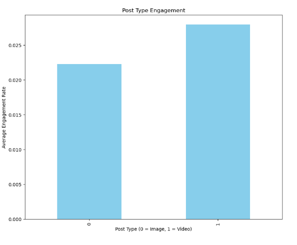

# Instagram Engagement Classification Project

## 📜 Project Overview  
This project focuses on predicting Instagram post engagement levels (high or low) using classification techniques. By analyzing key features such as followers, likes, comments, and post types (e.g., video, single or multiple images), the goal is to uncover patterns that influence engagement. The insights gained can help content creators and brands optimize their posting strategies to foster stronger audience interactions.


## 🎯 Problem Statement 
With this project, I am looking to answer these questions through classification:

1. Can we predict whether a post will have low or high engagement before it is posted? 
2. What are the key features that influence engagement on Instagram posts? 

The goal of this project is to predict using classification. Based on specific characteristics, I aim to predict whether Instagram posts will receive high or low engagement. Engagement is measured through likes and comments, and I aim to predict this before the post is published to Instagram. 

From an entrepreneurial perspective, understanding engagement is crucial for brands, content creators, and marketers, as it reflects audience interest and involvement. By predicting the level of engagement, this project seeks to optimize posting strategies, leading to improved interaction and engagement, leading to more meaningful connections with followers. 

---

## 📊 Introducing the Data   
The dataset used is sourced from [Kaggle: Instagram Data](https://www.kaggle.com/datasets/propriyam/instagram-data).  
**Key Features**:  
- 'is_video': boolean ( 1=video, 0=image)
- 'caption': string (text that is included within the post)
- 'comments': integer (number of comments on the post)
- 'likes': integer (number of likes on the post)
- 'created_at': integer (timestamp indicating the creation time of the post)
- 'multiple_images': boolean
- 'followers': integer 

---

## 🧹 Data Preprocessing  
Preprocessing is a crucial step in the OSEMN pipeline, as it involves the “cleaning” of data before any further processing. This step ensures that the errors are addressed and missing or inaccurate values are removed or corrected, providing a solid foundation for meaningful insights.  

Here are the pre-processing steps I took to prepare the data for analysis:  

- **Handling missing values** by using `isnull()` in order to identify the missing data.  
- **Fill and drop missing values**: if there is no caption or location, I have filled out with placeholder values such as “no location” and “no caption.”  
- **Classifying posts** into higher engagement and lower engagement based on their engagement rate.  
- **Converting boolean features** like `is_video` and `multiple_images` into numerical values. I have decided that I wanted to make `1` as true and `0` for false.  
- **Train test split** the data using `train_test_split()`  
- **Removing irrelevant features** that aren't important to predicting engagement.  
- **Handling Missing Values**: Filled missing captions and locations with placeholders like `no caption` and `no location`.  

---

## 📈 Visualizations  
To understand the data, I visualized key features such as engagement rates, the distribution of likes/comments, and the correlation between variables.

### Correlation Heatmap  
Examined relationships between features such as followers, likes, and comments.  


```python
import seaborn as sns
import matplotlib.pyplot as plt

correlation_matrix = df[['followers', 'likes', 'comments']].corr()
plt.figure(figsize=(8, 6))
sns.heatmap(correlation_matrix, annot=True, cmap='coolwarm', fmt='.2f', cbar=True)
plt.title('Correlation Heatmap of Instagram Features', fontsize=16)
plt.show()
```

### Bar Chart  
Compared average engagement rates for posts with single vs. multiple images.  



```python
post_type_engagement = df.groupby('is_video')['engagement_rate'].mean()
fig, ax = plt.subplots(figsize=(10, 8))
post_type_engagement.plot(kind='bar', color='skyblue', ax=ax)
ax.set(title="Post Type Engagement", 
       xlabel="Post Type (0 = Image, 1 = Video)", 
       ylabel="Average Engagement Rate")
plt.show()
```

---

## 🤖 Modeling  
- Used **Logistic Regression** for binary classification of engagement levels.  
- Achieved an **accuracy score of 98.93%** on the test set.  
- Evaluation included a confusion matrix and classification report.

```python
model = LogisticRegression() 
model.fit(X_train, y_train) 
y_pred = model.predict(X_test)

accuracy = accuracy_score(y_test, y_pred) 
print("Accuracy:", accuracy)

# Detailed performance report
print(classification_report(y_test, y_pred, target_names=['low', 'high']))
```

### Confusion Matrix  
```python
# Compute confusion matrix
cm = confusion_matrix(y_test, y_pred)

# Plot confusion matrix
plt.figure(figsize=(8, 6))
sns.heatmap(cm, annot=True, fmt='d', cmap='Blues', xticklabels=['Low', 'High'], yticklabels=['Low', 'High'])
plt.title('Confusion Matrix')
plt.xlabel('Predicted Label')
plt.ylabel('True Label')
plt.show()

```

---

## 📖 Insights  
1. Posts with **multiple images** showed slightly higher engagement on average.  
2. Engagement doesn't solely depend on follower count—**timing, content type**, and **post format** are significant.  

---

## 🌟 Impact  
- **For Content Creators**: Offers insights to tailor posts for better engagement.  
- **For Brands**: Enhances posting strategies to reach a larger audience effectively.  
- **Ethical Considerations**: While useful, such models could incentivize creators to prioritize engagement metrics over authentic content.


---

## 💡 Future Work  
- Experiment with advanced models like **Random Forest** or **Gradient Boosting** to address overfitting issues.  
- Explore additional features, such as **post timing** or **hashtag usage**.

---

## 📜 References  
1. [Kaggle Dataset: Instagram Data](https://www.kaggle.com/datasets/propriyam/instagram-data)  
2. [Scikit-learn: Logistic Regression Documentation](https://scikitlearn.org/dev/modules/generated/sklearn.linear_model.LogisticRegression.html)  
3. [IBM: Logistic Regression Overview](https://www.ibm.com/topics/logistic-regression)  
4. [Scikit-learn: Confusion Matrix Documentation](https://scikitlearn.org/dev/modules/generated/sklearn.metrics.confusion_matrix.html)  
5. [Medium: How to Create a Seaborn Correlation Heatmap](https://medium.com/@szabo.bibor/how-to-create-a-seaborn-correlation-heatmap-in-python-834c0686b88e)  
6. [Seaborn: Heatmap Documentation](https://seaborn.pydata.org/generated/seaborn.heatmap.html)  
7. [W3Schools: Confusion Matrix Explanation](https://www.w3schools.com/python/python_ml_confusion_matrix.asp)  


