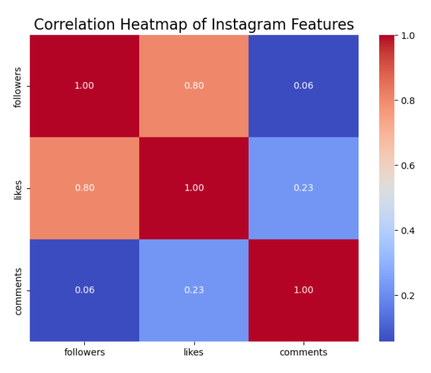

# Instagram Engagement Classification Project

## 📜 Project Overview  
This project focuses on predicting Instagram post engagement levels (high or low) using classification techniques. By analyzing key features such as followers, likes, comments, and post types (e.g., video, single or multiple images), the goal is to uncover patterns that influence engagement. The insights gained can help content creators and brands optimize their posting strategies to foster stronger audience interactions.


## 🎯 Problem Statement 
With this project, I am looking to answer these questions through classification:

1. Can we predict whether a post will have low or high engagement before it is posted? 
2. What are the key features that influence engagement on Instagram posts? 

The goal of this project is to predict using classification. Based on specific characteristics, I aim to predict whether Instagram posts will receive high or low engagement. Engagement is measured through likes and comments, and I aim to predict this before the post is published to Instagram. 

From an entrepreneurial perspective, understanding engagement is crucial for brands, content creators, and marketers, as it reflects audience interest and involvement. By predicting the level of engagement, this project seeks to optimize posting strategies, leading to improved interaction and engagement, leading to more meaningful connections with followers. 

---

## 📊 Introducing the Data   
The dataset used is sourced from [Kaggle: Instagram Data](https://www.kaggle.com/datasets/propriyam/instagram-data).  
**Key Features**:  
- 'is_video': boolean ( 1=video, 0=image)
- 'caption': string (text that is included within the post)
- 'comments': integer (number of comments on the post)
- 'likes': integer (number of likes on the post)
- 'created_at': integer (timestamp indicating the creation time of the post)
- 'multiple_images': boolean
- 'followers': integer 

---

## 🧹 Data Preprocessing  
Preprocessing is a crucial step in the OSEMN pipeline, as it involves the “cleaning” of data before any further processing. This step ensures that the errors are addressed and missing or inaccurate values are removed or corrected, providing a solid foundation for meaningful insights.  

Here are the pre-processing steps I took to prepare the data for analysis:  

- **Handling missing values** by using `isnull()` in order to identify the missing data.  
- **Fill and drop missing values**: if there is no caption or location, I have filled out with placeholder values such as “no location” and “no caption.”  
- **Classifying posts** into higher engagement and lower engagement based on their engagement rate.  
- **Converting boolean features** like `is_video` and `multiple_images` into numerical values. I have decided that I wanted to make `1` as true and `0` for false.  
- **Train test split** the data using `train_test_split()`  
- **Removing irrelevant features** that aren't important to predicting engagement.  
- **Handling Missing Values**: Filled missing captions and locations with placeholders like `no caption` and `no location`.  

---

## 📈 Visualizations  
To understand the data, I visualized key features such as engagement rates, the distribution of likes/comments, and the correlation between variables.

### Correlation Heatmap  
Examined relationships between features such as followers, likes, and comments.  



```python
import seaborn as sns
import matplotlib.pyplot as plt

correlation_matrix = df[['followers', 'likes', 'comments']].corr()
plt.figure(figsize=(8, 6))
sns.heatmap(correlation_matrix, annot=True, cmap='coolwarm', fmt='.2f', cbar=True)
plt.title('Correlation Heatmap of Instagram Features', fontsize=16)
plt.show()
```

### Bar Chart  
Compared average engagement rates for posts with single vs. multiple images.  

bar chart.png


```python
post_type_engagement = df.groupby('is_video')['engagement_rate'].mean()
fig, ax = plt.subplots(figsize=(10, 8))
post_type_engagement.plot(kind='bar', color='skyblue', ax=ax)
ax.set(title="Post Type Engagement", 
       xlabel="Post Type (0 = Image, 1 = Video)", 
       ylabel="Average Engagement Rate")
plt.show()
```

---

## 🤖 Modeling  
I used logistic regression into model the data in this project. This analysis technique is particularly effective for binary classification tasks, as it establishes a relationship between two factors—predictor variables and a binary outcome. Logistic regression uses this relationship to predict the likelihood of one of the binary outcomes based on the input features. Additionally, it offers simplicity and interpretability, making it an excellent choice for understanding how various predictors influence the target variable. It can handle binary regression problems effectively and it can handle binary classification. 

Pros and Cons of Logistic Regression 
Pros: 
- Easily interpreted
- Works well with binary classification 

Cons:
- Makes a linear relationship between the features and target. 
- Could underperform when it comes to complex relationships. 

## Model Performance
The logistic regression model showed an accuracy of 98.9%. Evaluation metrics included: 
- Accuracy Score 
- Classification Report
  

```python
model = LogisticRegression() 
model.fit(X_train, y_train) 
y_pred = model.predict(X_test)

accuracy = accuracy_score(y_test, y_pred) 
print("Accuracy:", accuracy)

# Detailed performance report
print(classification_report(y_test, y_pred, target_names=['low', 'high']))
```


A confusion matrix revealed that the model effectively classified both high and low level engagement levels with minimal misclassification. 


```python
# Compute confusion matrix
cm = confusion_matrix(y_test, y_pred)

# Plot confusion matrix
plt.figure(figsize=(8, 6))
sns.heatmap(cm, annot=True, fmt='d', cmap='Blues', xticklabels=['Low', 'High'], yticklabels=['Low', 'High'])
plt.title('Confusion Matrix')
plt.xlabel('Predicted Label')
plt.ylabel('True Label')
plt.show()

```

---

## 📖 Evaluation 
Logistic regression performed exceptionally well, with a high accuracy score and balanced precision-recall values for both classes. However I first had thought of using Random Forest but it didn't work since it risked overfitting due to the dataset size and feature distribution. Logistic regression was ultimately chosen for this project due its balance of performance and interpretability, making it suitable for understanding the factors driving engagement.

1. Posts with **multiple images** showed slightly higher engagement on average.  
2. Engagement doesn't solely depend on follower count—**timing, content type**, and **post format** are significant.  

---


## Final Conclusion: Storytelling 
Throughout this project, I learned that features of Instagram posts influence engagement levels and that data can uncover hidden patterns. With the use of logistic regression, I discovered that factors such as post type (video vs. image), follower count, and the presence of multiple images play roles in determining engagement. 


A key finding was that follower count alone does not guarantee high engagement. Posts that had a smaller audience but more targeted or aesthetically pleasing content often performed better than those with a broader, less engaged audience. This insight highlighted the importance of quality over quantity for social media marketing strategy. For example, the data showed that videos tend to receive higher engagement that images, suggesting that dynamic content might capture audience engagement more effectively. Similarly, posts that contained multiple images resulted in higher engagement, revealing that diverse content within a single post can be a powerful way to keep followers interested.


Through the completion of my project, I was able to answer the initial questions posed:


- **Can we predict engagement levels?** Yes, with an accuracy of 98.9%, the logistic regression model effectively predicted whether posts would receive high or low engagement.

- **What features drive engagement?** Post type, follower count, and multi-image content emerged as key predictors, providing important insights for creators and marketers.


Through this project, I now have a better understanding of the complex interactions between post characteristics interact to influence engagement, providing both predictive and interpretative value for practical applications.


## 🌟 Impact  
This project has various social and ethical implications. On the bright side, the insights gained can help content creators and brands design content that resonates more with their audiences, building stronger connections. For small businesses or individual creators, improving engagement could lead to greater visibility, audience growth, and financial stability.


However, it is important to consider that there are ethical considerations. Predicting engagement on features like follower count and content type can create bias. For example, creators with smaller, niche audiences might feel pressured to conform to trends that prioritize engagement metrics over authenticity. Similarly, emphasizing the metrics on likes and comments can worsen the existing culture of comparison on social media, impacting mental health.


From a societal standpoint, this project highlights how data can influence digital strategies. When applied responsibly, these insights can strengthen authentic connections and promote ethical marketing practices. However, it's crucial to balance engagement optimization with maintaining the creative and personal integrity of content.


This project emphasizes the dual role of data-driven decisions in social media. It is an amazing tool for empowerment but also demands careful, thoughtful, ethical consideration.


Overall this project emphasizes the dual role of data-driven decisions in social media: a tool for empowerment but also one that demands thoughtful ethical consideration. Looking ahead, there should be more enforcement on safeguards that maintain authenticity and minimize harm in data-driven social media.

**Overview** 

- **For Content Creators**: Offers insights to tailor posts for better engagement.  
- **For Brands**: Enhances posting strategies to reach a larger audience effectively.  
- **Ethical Considerations**: While useful, such models could incentivize creators to prioritize engagement metrics over authentic content.


---

## 💡 Future Work  
- Experiment with advanced models like **Random Forest** or **Gradient Boosting** to address overfitting issues.  
- Explore additional features, such as **post timing** or **hashtag usage**.

---

## 📜 References  
1. [Kaggle Dataset: Instagram Data](https://www.kaggle.com/datasets/propriyam/instagram-data)  
2. [Scikit-learn: Logistic Regression Documentation](https://scikitlearn.org/dev/modules/generated/sklearn.linear_model.LogisticRegression.html)  
3. [IBM: Logistic Regression Overview](https://www.ibm.com/topics/logistic-regression)  
4. [Scikit-learn: Confusion Matrix Documentation](https://scikitlearn.org/dev/modules/generated/sklearn.metrics.confusion_matrix.html)  
5. [Medium: How to Create a Seaborn Correlation Heatmap](https://medium.com/@szabo.bibor/how-to-create-a-seaborn-correlation-heatmap-in-python-834c0686b88e)  
6. [Seaborn: Heatmap Documentation](https://seaborn.pydata.org/generated/seaborn.heatmap.html)  
7. [W3Schools: Confusion Matrix Explanation](https://www.w3schools.com/python/python_ml_confusion_matrix.asp)  


